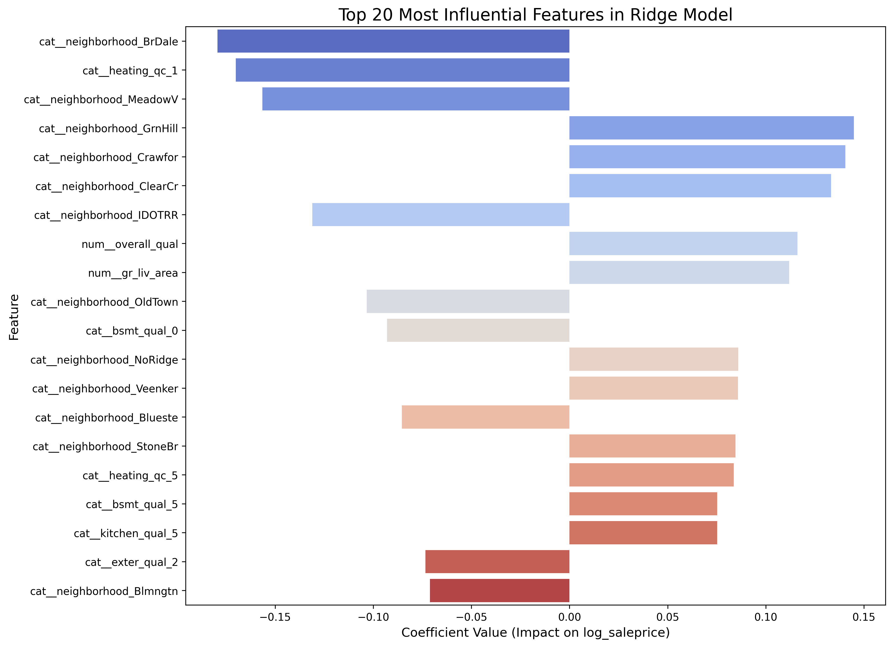

# Project: Ames Housing Price Prediction

This project is a two-part case study focused on predicting house sale prices using the Ames, Iowa housing dataset. The analysis is heavily oriented towards statistical rigor and building an interpretable baseline model.

### Part 1: Exploratory Data Analysis (EDA)
The EDA focused on understanding the features, handling a large number of missing values, and preparing the data for regression modeling.

**Key Findings:**
*   The target variable, `SalePrice`, was found to be highly right-skewed and was **log-transformed** to meet the assumptions of linear models.
*   **Overall Quality (`OverallQual`)** and **Above-Ground Living Area (`GrLivArea`)** were identified as the most powerful numerical predictors.
*   **Neighborhood** was confirmed as the most critical categorical feature influencing price.

### Part 2: Predictive Modeling
A **Ridge (L2 Regularized) Regression model** was built to create a strong, interpretable baseline. The model was tuned using `GridSearchCV`.

The final model performed very well, achieving an **R-squared of 0.85** and an RMSE of approximately **$34,500**. The feature importance plot below shows the key drivers learned by the model, confirming the EDA findings.

**Full analysis and models can be found in the notebooks:**
*   [View the EDA Notebook](./Ames_Housing_EDA.ipynb)
*   [View the Modeling Notebook](./Ames_Housing_Model.ipynb)
*   [View the Clean HTML Report of the EDA](./Ames_Housing_EDA.html)
*   [View the Clean HTML Report of the Modeling](./Ames_Housing_Model.html)
