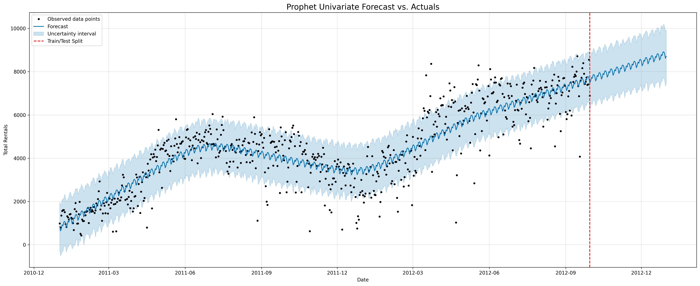

# Project: Bike Sharing Demand Forecast

This project is a two-part case study focused on analyzing and forecasting the demand for a bike sharing program in Washington D.C.

### Part 1: Exploratory Data Analysis (EDA)
The EDA focused on uncovering the temporal patterns in the hourly rental data.

**Key Findings:**
*   A **strong year-over-year growth trend** was identified.
*   The data revealed two distinct rider personas: **"Commuters"** (with sharp 8 AM and 5 PM peaks on weekdays) and **"Leisure Riders"** (with a broad afternoon peak, especially on weekends).
*   Demand was also shown to be highly dependent on weather conditions and seasonality.

### Part 2: Time Series Forecasting
Building on the EDA, a **Multivariate Prophet model** was developed to forecast daily bike rental demand. The model was chosen for its ability to handle multiple seasonalities (weekly and yearly) and to incorporate weather data as an external regressor.

The final Prophet model significantly outperformed a traditional SARIMAX baseline, **reducing the forecast error (RMSE) by over 58%**. The plot below shows the final forecast against the actual test data.

**Full analysis and models can be found in the notebooks:**
*   [View the EDA Notebook](./Bike_Sharing_EDA.ipynb)
*   [View the Forecasting Notebook](./Bike_Sharing_Forecasting.ipynb)
*   [View the Clean HTML Report of the EDA](https://htmlpreview.github.io/?https://raw.githubusercontent.com/jalhane88/Data-Analysis-Portfolio/refs/heads/main/project_bike_sharing/Bike_Sharing_EDA.html)
*   [View the Clean HTML Report of the Forecast](https://htmlpreview.github.io/?https://raw.githubusercontent.com/jalhane88/Data-Analysis-Portfolio/refs/heads/main/project_bike_sharing/Bike_Sharing_Forecasting.html)
