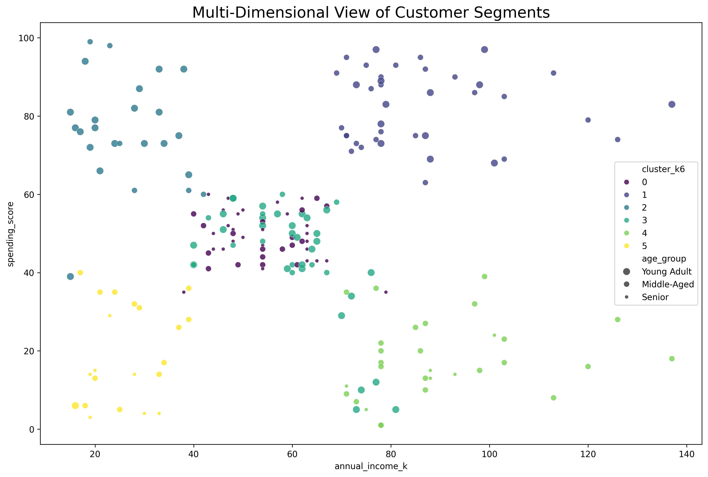

# Project: Customer Segmentation with K-Means Clustering

This project demonstrates the use of **unsupervised machine learning** to discover hidden patterns in customer data. The goal was to segment customers of a shopping mall into distinct groups based on their spending habits, income, and age, without any pre-existing labels.

### The Analytical Process

1.  **Exploratory Data Analysis:** Initial EDA revealed strong potential for clustering based on the `Annual Income` and `Spending Score` features.
2.  **Optimal Cluster Selection:** The **Elbow Method** and the **Silhouette Score** were used to determine that a robust segmentation into **6 distinct groups** was optimal.
3.  **K-Means Clustering:** The K-Means algorithm was applied to the scaled data to create the final customer segments.

### The Six Customer Segments

The analysis successfully identified six meaningful customer personas by analyzing their income, spending habits, and age. The multi-dimensional visualization below shows these distinct segments, where **color represents the segment**, and the **size of the bubble represents the age group**.

This rich segmentation allows the marketing team to move from a generic strategy to highly targeted campaigns tailored to the specific behaviors and demographics of each group.

**The full analysis can be found in the notebook:**
*   [View the Notebook](./Customer_Segmentation_with_KMeans.ipynb)
*   [View the Clean HTML Report](./Customer_Segmentation_with_KMeans.html)
