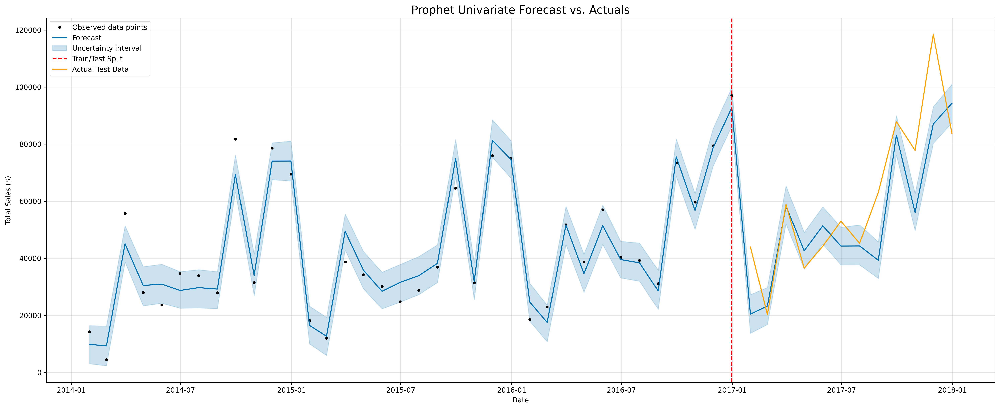

# Project: Superstore Sales Analysis & Forecasting

This project is a comprehensive two-part case study on a large retail dataset, moving from historical analysis to future prediction.

### Part 1: Exploratory Data Analysis (EDA)
The EDA focused on dissecting the Superstore's performance to identify key drivers of sales and profitability.

**Key Findings:**
*   **Profitability Issues:** The `Furniture` category was identified as a major problem area, generating high sales but extremely low profit, primarily due to heavy losses in the `Tables` sub-category.
*   **Geographical Concentration:** A handful of states, particularly **California and New York**, were found to be the primary profit drivers, while states like **Texas and Pennsylvania** were significant loss centers.
*   **Customer-Level Insights:** Analysis revealed "problem customers" whose high-discount, high-ticket orders were responsible for a disproportionate amount of the company's losses.

### Part 2: Time Series Forecasting
Building on the EDA, a **Prophet forecasting model** was developed to predict total monthly sales.

The final model successfully captured the strong upward trend and yearly seasonality in the data, significantly outperforming a traditional SARIMAX baseline. It achieved a **Mean Absolute Percentage Error (MAPE) of ~19%**, providing a reliable tool for future business planning.

**Full analysis and models can befound in the notebooks:**
*   [View the EDA Notebook](./Retail_Sales_EDA.ipynb)
*   [View the Forecasting Notebook](./Retail_Sales_Forecasting.ipynb)
*   [View the Clean HTML Report of the EDA](https://htmlpreview.github.io/?https://raw.githubusercontent.com/jalhane88/Data-Analysis-Portfolio/refs/heads/main/project_retail_sales/Retail_Sales_EDA.html)
*   [View the Clean HTML Report of the Forecasting](https://htmlpreview.github.io/?https://raw.githubusercontent.com/jalhane88/Data-Analysis-Portfolio/refs/heads/main/project_retail_sales/Retail_Sales_Forecasting.html)
