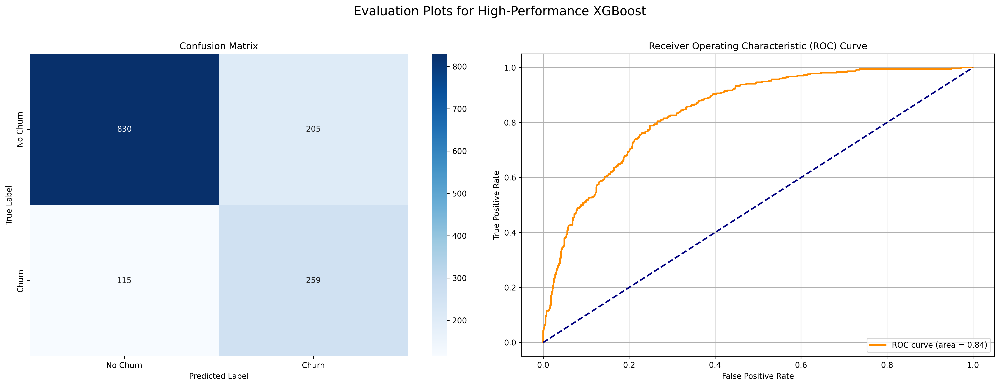

# Project: Telco Customer Churn Analysis & Prediction

This project is a two-part case study into customer churn for a telecommunications company.

### Part 1: Exploratory Data Analysis (EDA)
The goal of the EDA was to identify the key drivers of customer churn from the raw data.

**Key Findings:**
*   **Contract Type:** This is the most significant factor. Customers on `Month-to-Month` contracts churn at a rate of over 40%.
*   **Tenure:** New customers (low tenure) are at a much higher risk of churning.
*   **Service Add-ons:** Customers without "protective" services like `Online Security` and `Tech Support` are significantly more likely to leave.

### Part 2: Predictive Modeling
Building on the EDA, a high-performance **XGBoost classification model** was developed to predict which customers are likely to churn.

The final model achieved an **AUC score of 0.84**.

**Full analysis and models can be found in the notebooks:**
*   [View the EDA Notebook](./Telco_Churn_EDA.ipynb)
*   [View the Modeling Notebook](./Telco_Churn_Model.ipynb)
*   [View the Clean HTML Report of the EDA](./Telco_Churn_EDA.html)
*   [View the Clean HTML Report of the Modeling](./Telco_Churn_Model.html)
